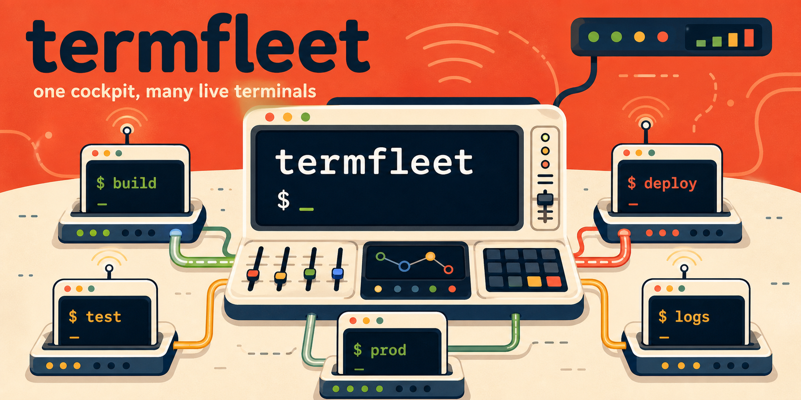
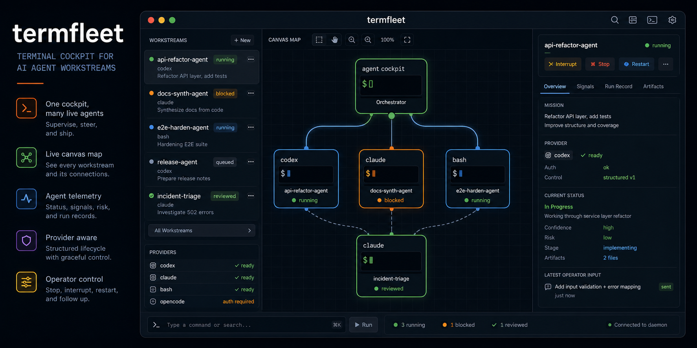
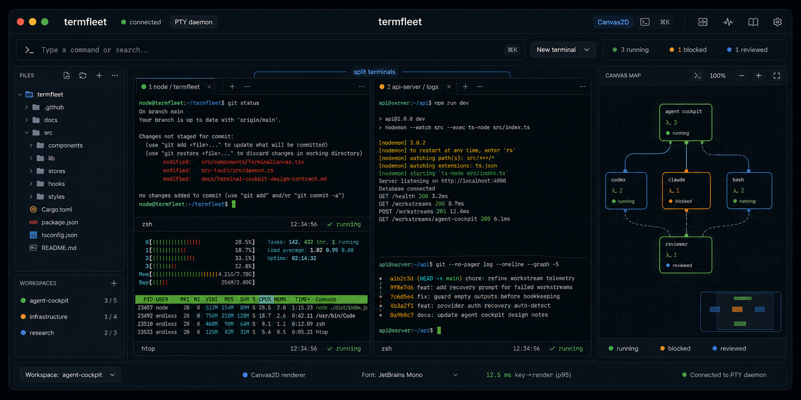
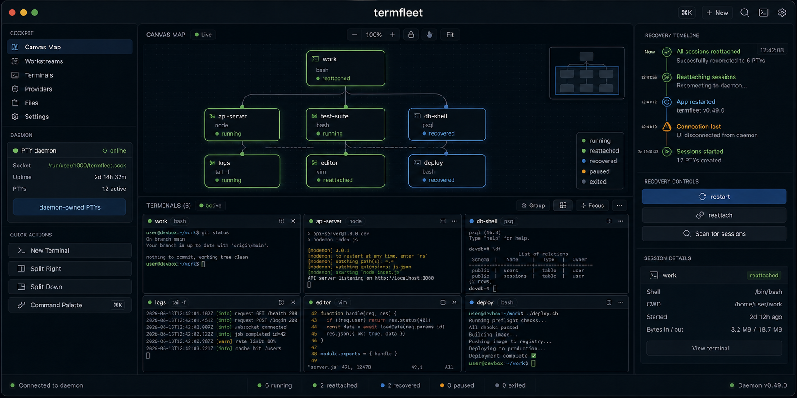

# termfleet

termfleet is a terminal cockpit for multi-session operations: live terminals,
recoverable PTYs, canvas-based workspace maps, and supervised agent workstreams
in one native Tauri app.

It is **not** trying to be another terminal emulator skin. The preview goal is a
local-first operations cockpit: many terminals, local services, task-bound map
nodes, recovery state, and agent runs stay visible as one workspace.

## What It Is

- A Linux-first desktop workbench for supervising multiple terminal-backed
  workstreams.
- A local-first agent cockpit for Codex, Claude Code, OpenCode, and shell
  sessions.
- A recoverable PTY workspace: daemon-owned terminal processes survive UI
  restart and are restored as explicit live, stale, failed, or closed states.
- A service and evidence surface: localhost previews, task bindings, run
  summaries, and verification bundles are part of the workspace, not separate
  notes.

## What It Is Not

- Not a cloud agent orchestrator.
- Not a tmux/zellij replacement; those can run inside TermFleet terminals.
- Not a generic terminal theme project.
- Not cross-platform yet. Linux is the first release gate.

## Quick Start

Prerequisites:

- Linux desktop with WebKitGTK/Tauri runtime dependencies.
- Node.js 20+ and npm.
- Rust stable with Cargo.

Install and run the browser review surface:

```bash
npm run verify:prerequisites
npm install
npm run review
```

Run the native Tauri app:

```bash
npm run tauri:dev
```

Run the fast frontend build gate:

```bash
npm run verify:prerequisites
npm run build
```

`verify:prerequisites` checks Node, npm, Rust/Cargo, `pkg-config`, WebKitGTK
4.1, JavaScriptCoreGTK 4.1, libsoup 3, and the lockfile before the heavier
install/build commands. If a fresh checkout cannot build, start there: the
script reports the missing system package family instead of letting Tauri fail
deep in a native build.

The historical launcher name `run-native-vte-dev.sh` is retained for muscle
memory, but the production desktop terminal path is Canvas2D over the headless
VT grid.

## Architecture

TermFleet splits terminal ownership from the UI:

- The Rust daemon owns PTYs over a user-local Unix socket.
- Rust feeds terminal bytes into an `alacritty_terminal` headless VT grid.
- The React/Tauri UI renders that grid into a plain HTML canvas with Canvas2D.
- React mounts attach/detach from sessions; they do not own foreground
  processes.
- The operations map, preview panes, task bindings, and agent metadata are
  workspace instruments around the terminal surface.

Key docs:

- `docs/recoverable-terminal-architecture.md`
- `docs/terminal-transport-failure-recovery.md`
- `docs/terminal-cockpit-design-contract.md`
- `docs/visual-qa-review.md`

## Visual Tour

### Agent Cockpit

Supervise Codex, Claude, OpenCode, and shell workstreams from the same canvas
where terminal sessions live.



### Canvas Terminals

The production terminal surface uses a headless VT grid rendered through
Canvas2D, with split panes, file context, and a strategic map in the same
workspace.



### Recoverable Sessions

PTYs are daemon-owned, so the UI can restart and reattach to live sessions
instead of treating the app window as the owner of terminal processes.



## Restore Workspace Proof

TermFleet has two recovery layers:

- **App restart reattach:** the Tauri window can close or restart while the
  user-local daemon keeps PTYs alive, then the relaunched UI reattaches to the
  same sessions.
- **Cold restore:** if the daemon is gone, persisted workspace/session metadata
  comes back as restartable stale sessions instead of silently deleting the
  user's workspace shape.

Run the repeatable proof path before claiming recovery works:

```bash
npm run verify:restart-restore
npm run verify:standalone-daemon
```

`verify:restart-restore` checks the daemon/socket restore layers without a GUI.
`verify:standalone-daemon` runs the release app against an isolated private
runtime, captures app-restart and daemon-cold-restore screenshots under
`/tmp/tw-standalone-daemon-smoke/`, and proves post-restore input still reaches
the terminal. Recovery is a product feature, not a best-effort cache restore:
React unmounts detach, explicit close/stop destroys, and stale sessions remain
visible until restarted or closed.

## Local Agent Status Summaries

TermFleet can summarize live terminal and agent output into compact
Task/Path/Now header text. The app always has a deterministic fallback; for a
local small-LLM pass, the normal Tauri dev launcher starts the status-summary
server automatically:

```bash
npm run tauri:dev
```

The launcher uses `http://127.0.0.1:37819/status` and defaults the Ollama adapter
to `qwen3:4b` on this workstation. Override it when another tiny local model is
installed:

```bash
TERMFLEET_AGENT_STATUS_MODEL=gemma4:e2b-it npm run tauri:dev
```

Disable the sidecar with `TERMFLEET_AGENT_STATUS_DISABLE=1`. The app still shows
deterministic summaries if Ollama is unavailable or the sidecar is disabled.
Override the Ollama URL with `TERMFLEET_OLLAMA_URL`.

## Evidence Bundles

Export a redaction-safe local evidence bundle from the current TermFleet data
root:

```bash
npm run evidence:bundle -- --out /tmp/termfleet-evidence.md
```

The bundle summarizes workspace status, sessions, agent workstreams, preview
URLs, MASTER_PLAN task bindings, and verification commands. Token-shaped
secrets and machine-local absolute paths are redacted before export.

## Release Gate

Process survival is release-blocking. Before cutting a release candidate, run:

```bash
npm run verify:release
```

This gate includes the fast terminal reliability matrix, the daemon-survival
regression for build-id mismatches, socket-level restart/restore, daemon latency,
and the standalone release-app daemon smoke. App restarts and rebuilds must not
kill daemon-owned foreground processes; only explicit close/stop/restart,
`--fresh-daemon`, protocol incompatibility, or the operating system may do that.

## Contributing

This repository is not ready for broad drive-by contributions yet. Useful
preview feedback is still welcome when it includes:

- Linux distribution, desktop session, GPU/driver if rendering is involved.
- Exact command run.
- Verification output or screenshot.
- Whether the issue reproduces in `npm run review`, the native app, or both.

Keep changes small, regression-backed, and focused on visible cockpit behavior.
Do not add dependencies or cloud services without a design note and explicit
approval.

## Security

TermFleet is local-first. The daemon uses a user-local Unix socket and the app
must not expose terminal control to non-loopback or unauthenticated callers.

Do not include secrets, private paths, or proprietary terminal output in public
issues. Use `npm run evidence:bundle` when sharing repro context; it redacts
common token-shaped secrets and machine-local absolute paths.

Security disclosure path before public release: open a private maintainer
contact channel and add `SECURITY.md`. Until then, do not treat this repository
as a public vulnerability intake surface.

## Limitations

- Linux is the supported preview target.
- Browser review is useful for UI checks, but real PTY/daemon behavior requires
  the native Tauri app.
- Canvas2D is the production renderer; WebGL and native GTK/VTE terminal paths
  are intentionally not release targets.
- Restart controls are limited to sessions/workstreams that TermFleet owns.
- Localhost service detection is derived from terminal and preview metadata; it
  is not a background port scanner.

## Roadmap

- Finish the TC-021 public developer preview lane.
- Polish agent cockpit controls and evidence review.
- Improve local-services ownership and restart flows once command ownership is
  explicit.
- Redesign the map filter/header surface tracked by TC-025.
- Add public contribution, license, and security files before publishing.
