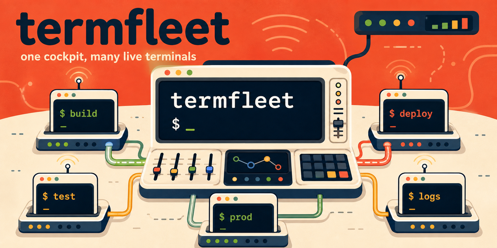
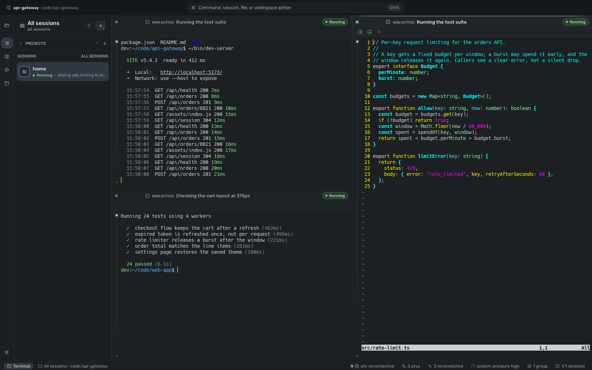
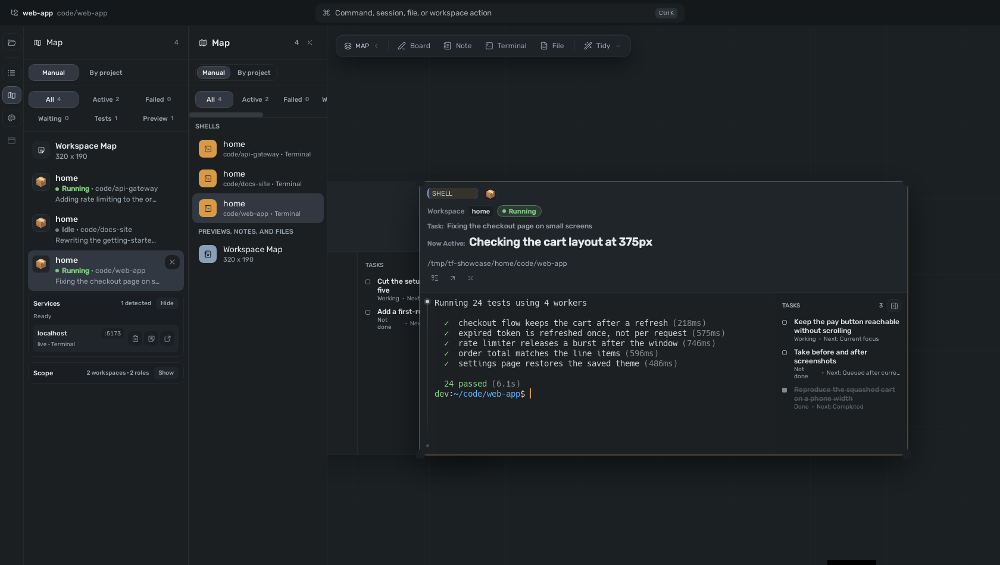
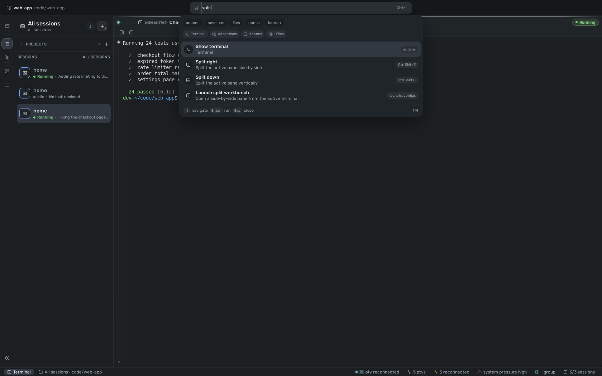

# termfleet

termfleet is a terminal cockpit for multi-session operations: live terminals,
recoverable PTYs, canvas-based workspace maps, and supervised agent workstreams
in one native Tauri app.

It is **not** trying to be another terminal emulator skin. The preview goal is a
local-first operations cockpit: many terminals, local services, task-bound map
nodes, recovery state, and agent runs stay visible as one workspace.

## What It Is

- A Linux-first desktop workbench for supervising multiple terminal-backed
  workstreams.
- A local-first agent cockpit for Codex, Claude Code, OpenCode, and shell
  sessions.
- A recoverable PTY workspace: daemon-owned terminal processes survive UI
  restart and are restored as explicit live, stale, failed, or closed states.
- A service and evidence surface: localhost previews, task bindings, run
  summaries, and verification bundles are part of the workspace, not separate
  notes.

## What It Is Not

- Not a cloud agent orchestrator.
- Not a tmux/zellij replacement; those can run inside TermFleet terminals.
- Not a generic terminal theme project.
- Not cross-platform yet. Linux is the first release gate.

## Download

Linux preview builds (unsigned) are published on the
[Releases page](https://github.com/endlessblink/termfleet/releases/latest):
an `.AppImage` that runs as-is, and a `.deb` for Debian/Ubuntu. Each release
ships `SHA256SUMS.txt` — verify a download with
`sha256sum -c SHA256SUMS.txt --ignore-missing`.

```bash
chmod +x TermFleet_*.AppImage && ./TermFleet_*.AppImage   # or: sudo dpkg -i TermFleet_*.deb
```

## Quick Start

Building from source instead. Prerequisites:

- Linux desktop with WebKitGTK/Tauri runtime dependencies.
- Node.js 20+ and npm.
- Rust stable with Cargo.

Install and run the browser review surface:

```bash
npm run verify:prerequisites
npm install
npm run review
```

Install the current source build, then launch TermFleet from the desktop dock:

```bash
npm run release:install
npm run verify:installed-release
```

For development-only native troubleshooting, launch the Tauri app with:

```bash
npm run tauri:dev
```

The dock is the normal operator and acceptance surface. Development launchers
are for internal troubleshooting only and are not a substitute for installing
and checking the release that the dock actually opens.

Run the fast frontend build gate:

```bash
npm run verify:prerequisites
npm run build
```

`verify:prerequisites` checks Node, npm, Rust/Cargo, `pkg-config`, WebKitGTK
4.1, JavaScriptCoreGTK 4.1, libsoup 3, and the lockfile before the heavier
install/build commands. If a fresh checkout cannot build, start there: the
script reports the missing system package family instead of letting Tauri fail
deep in a native build.

The production desktop terminal path is Canvas2D over the headless VT grid.

## Architecture

TermFleet splits terminal ownership from the UI:

- The Rust daemon owns PTYs over a user-local Unix socket.
- Rust feeds terminal bytes into an `alacritty_terminal` headless VT grid.
- The React/Tauri UI renders that grid into a plain HTML canvas with Canvas2D.
- React mounts attach/detach from sessions; they do not own foreground
  processes.
- The operations map, preview panes, task bindings, and agent metadata are
  workspace instruments around the terminal surface.

Key docs:

- `docs/recoverable-terminal-architecture.md`
- `docs/terminal-transport-failure-recovery.md`
- `docs/terminal-cockpit-design-contract.md`
- `docs/visual-qa-review.md`

## Visual Tour

Screenshots below are the running Linux app, captured by
`scripts/capture-showcase-shots.sh` on a private display against a scripted demo
workspace (invented projects and task lists, so nothing from a real machine
appears). Reproduce them with:

```bash
cd src-tauri && cargo build && cd ..
scripts/capture-showcase-shots.sh          # writes /tmp/tf-showcase/shots
```

### Split Terminals

The production terminal is a headless VT grid drawn to a canvas: split panes, a
live dev server, a finished test run, and a full-screen editor in one window.
Each pane header carries that pane's task and what it is doing right now.



### Operations Map

Every session is a node on a zoomable map. A node keeps its own task, its
current activity, its path, and its task list — so a fleet of sessions stays
readable without opening each one.



### Command Bar

One keystroke reaches every action, session, pane, and file — including the
splits and views above.



### Recoverable Sessions

PTYs are daemon-owned, so the UI can restart and reattach to live sessions
instead of treating the app window as the owner of terminal processes — proof
path in [Restore Workspace Proof](#restore-workspace-proof) below.

## Restore Workspace Proof

TermFleet has two recovery layers:

- **App restart reattach:** the Tauri window can close or restart while the
  user-local daemon keeps PTYs alive, then the relaunched UI reattaches to the
  same sessions.
- **Cold restore:** if the daemon is gone, persisted workspace/session metadata
  comes back as restartable stale sessions instead of silently deleting the
  user's workspace shape.

Run the repeatable proof path before claiming recovery works:

```bash
npm run verify:restart-restore
npm run verify:standalone-daemon
```

`verify:restart-restore` checks the daemon/socket restore layers without a GUI.
`verify:standalone-daemon` runs the release app against an isolated private
runtime, captures app-restart and daemon-cold-restore screenshots under
`/tmp/tw-standalone-daemon-smoke/`, and proves post-restore input still reaches
the terminal. Recovery is a product feature, not a best-effort cache restore:
React unmounts detach, explicit close/stop destroys, and stale sessions remain
visible until restarted or closed.

## Local Agent Status Summaries

TermFleet can summarize live terminal and agent output into compact
Task/Path/Now header text. The installed dock app reads deterministic local
status records directly, so it does not require a development server or Ollama.
Optional local-model experiments remain internal development work and never
change the dock-only operator workflow.

## Evidence Bundles

Export a redaction-safe local evidence bundle from the current TermFleet data
root:

```bash
npm run evidence:bundle -- --out /tmp/termfleet-evidence.md
```

The bundle summarizes workspace status, sessions, agent workstreams, preview
URLs, MASTER_PLAN task bindings, and verification commands. Token-shaped
secrets and machine-local absolute paths are redacted before export.

## Release Gate

For non-destructive developer-preview readiness, run:

```bash
npm run verify:developer-preview
```

This runs prerequisite, README/OSS, public-audit, recovery-doc,
evidence-bundle, agent-status, map-contract, and frontend build checks. It does
not run the heavier live desktop smoke tests.

Process survival is release-blocking. Before cutting a release candidate, run:

```bash
npm run verify:release
```

This gate includes the fast terminal reliability matrix, the daemon-survival
regression for build-id mismatches, socket-level restart/restore, daemon latency,
and the standalone release-app daemon smoke. App restarts and rebuilds must not
kill daemon-owned foreground processes; only explicit close/stop/restart,
`--fresh-daemon`, protocol incompatibility, or the operating system may do that.

## Contributing

This repository is not ready for broad drive-by contributions yet. Useful
preview feedback is still welcome when it includes:

- Linux distribution, desktop session, GPU/driver if rendering is involved.
- Exact command run.
- Verification output or screenshot.
- Whether the issue reproduces in `npm run review`, the native app, or both.

Keep changes small, regression-backed, and focused on visible cockpit behavior.
Do not add dependencies or cloud services without a design note and explicit
approval. See [`CONTRIBUTING.md`](CONTRIBUTING.md) for the development checks
and [`CODE_OF_CONDUCT.md`](CODE_OF_CONDUCT.md) for community expectations.

## Security

TermFleet is local-first. The daemon uses a user-local Unix socket and the app
must not expose terminal control to non-loopback or unauthenticated callers.

Do not include secrets, private paths, or proprietary terminal output in public
issues. Use `npm run evidence:bundle` when sharing repro context; it redacts
common token-shaped secrets and machine-local absolute paths.

Security disclosure: report vulnerabilities privately via the process in
[`SECURITY.md`](SECURITY.md) (GitHub private reporting or the maintainer email) —
not in public issues. The daemon listens only on a `0700` user-owned Unix socket
with a `0600` inode and rejects connections whose peer uid differs from its own.

## License

TermFleet is released under the [Apache License 2.0](LICENSE). The package
metadata and source license are aligned as `Apache-2.0`.

## Limitations

- Linux is the supported preview target.
- Browser review is useful for UI checks, but real PTY/daemon behavior requires
  the native Tauri app.
- Canvas2D is the production renderer; WebGL and native GTK/VTE terminal paths
  are intentionally not release targets.
- Restart controls are limited to sessions/workstreams that TermFleet owns.
- Localhost service detection is derived from terminal and preview metadata; it
  is not a background port scanner.
- RTL/Hebrew PTY output is best-effort; full BiDi/nikud terminal shaping (TC-018)
  is deferred.
- After a full reboot, running processes are not resurrected — only terminal
  content (last ~200 KB of scrollback) plus cwd and window size are restored. A
  hard crash can lose up to the last ~750 ms of unflushed output.

## Roadmap

- Finish the TC-021 public developer preview lane.
- Polish agent cockpit controls and evidence review.
- Improve local-services ownership and restart flows once command ownership is
  explicit.
- Redesign the map filter/header surface tracked by TC-025.
- Now licensed under Apache-2.0 with a `SECURITY.md` vulnerability-intake path;
  Linux AppImage/.deb releases are cut by pushing a `v*` tag (see CI workflows).
